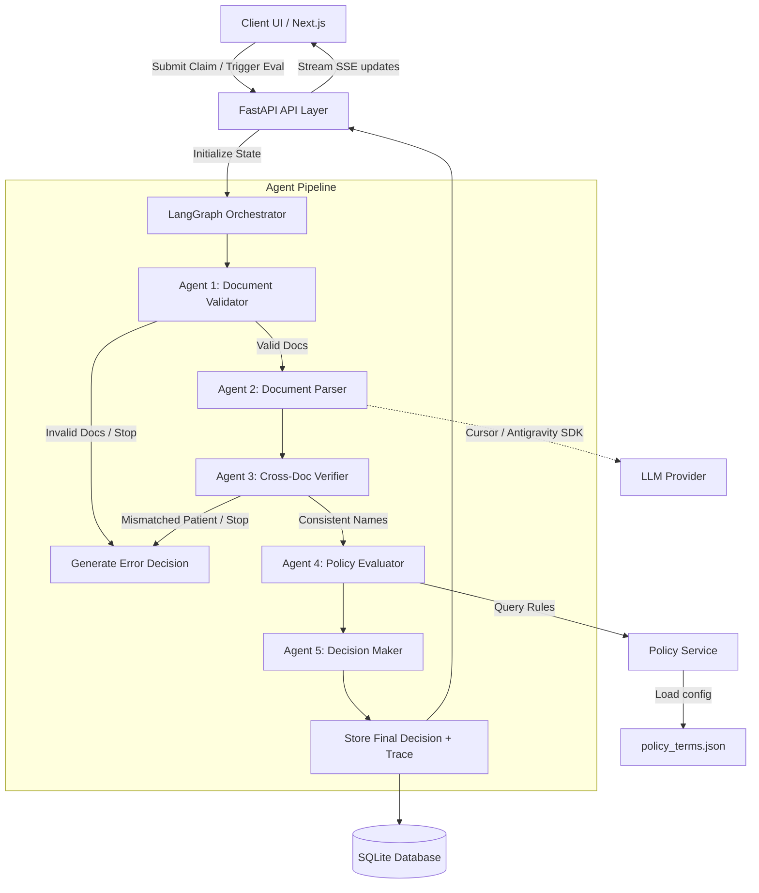

# Plum OPD Claims Processing System

An AI-powered, multi-agent health insurance claims processing system designed for Out-Patient Department (OPD) claims, featuring full observability, deterministic financial logic, and a dynamic real-time evaluation dashboard.

The system utilizes **LangGraph** to coordinate a 5-agent pipeline that processes unstructured claims documents (prescriptions, hospital bills) and policy terms to output a verifiable claim decision with a complete audit trace. It natively supports both the **Cursor SDK** (`gpt-5.4-nano`) and the **Google Antigravity SDK** for programmatic document parsing and live thought streaming.

---

## 🏗️ System Architecture

The project is structured as a decoupled web application with a FastAPI backend and a Next.js frontend, storing claim records and execution traces in a local SQLite database.



### Key Architectural Layers

1. **Frontend (Next.js 15)**: A responsive interface styled with Tailwind CSS, utilizing Server-Sent Events (SSE) to display live model thinking and sequential test execution progress.
2. **Backend (FastAPI & Python 3.14)**: High-performance async API wrapping the agent pipeline.
3. **Pipeline (LangGraph)**: A state graph with conditional edges that controls execution flow based on validation status and validation consistency.
4. **Database (SQLite & SQLAlchemy)**: Persists claim inputs, parsed structured fields, and a full checklist-by-checklist execution audit log (the trace).
5. **Rules Engine (Policy Service)**: A single-source-of-truth service loaded from `policy_terms.json` to prevent hardcoded business rules inside the agent code.

---

## 💡 Core Design Decisions

### 1. Deterministic Financial Logic (Zero LLM Hallucinations)
> [!IMPORTANT]
> Insurance claim decisions must be reproducible and auditable. An LLM must never decide whether a claim is approved or how much money is disbursed.
- **LLM Boundary**: LLMs are strictly confined to **unstructured text parsing** (extracting patient names, diagnosis codes, medicines, line items, and totals).
- **Rule Engine**: All policy limit checks, waiting periods, cosmetic exclusions, network discounts, and co-pays are evaluated using deterministic Python code against `policy_terms.json`. If a claim is re-evaluated, it will produce the exact same financial output every time.

### 2. Multi-Agent Control Flow via LangGraph
Instead of a simple sequential chain, the system maps agents as nodes in a LangGraph `StateGraph`:
- **Early Stop Edges**: If Agent 1 detects a wrong document type, or if Agent 3 detects different patient names on the prescription vs the bill, the pipeline halts immediately. This prevents wasting API tokens on invalid claims.
- **State Accumulation**: A unified state dictionary (`ClaimPipelineState`) passes between nodes, collecting extraction results, checks performed, and confidence logs.

### 3. Graceful Degradation & Resilience
In production, external LLM APIs can time out or fail. The system is designed to degrade gracefully:
- **Safety Wrappers**: Each LangGraph node is wrapped in robust exception handling.
- **Degraded Confidence**: If the parser fails (e.g. rate limit, bad API key), the system registers `component_failed=True`, reduces the confidence score by `0.2` (minimum `0.3`), falls back to metadata extraction, and continues processing.
- **Audit Alert**: The final claim decision is routed to `MANUAL_REVIEW` due to the component failure, but a complete policy audit is still performed for the reviewer.

### 4. Comprehensive Audit Traceability
Insurance is a highly regulated domain. Every agent logs its steps into a `FullTrace` object containing:
- **Check Results**: A detailed list of checks (check name, status, user message, internal details).
- **Inputs & Outputs**: Summarized snapshots of what each agent received and returned.
- This complete trace is returned in the API and rendered visually in the UI so reviewers can inspect the reasoning behind any deduction.

---

## 🤖 Multi-LLM SDK Support

The system natively supports three LLM provider SDKs for extracting document data and streaming reasoning deltas. The active provider is determined via backend environment configuration:

### 1. Cursor SDK
Utilizes the local `cursor_sdk` library with the `gpt-5.4-nano` model.
- **Stream Bridging**: Since the Cursor SDK blocks during synchronous generation, the backend multiplexes token streaming to the async ASGI event loop using a thread-safe `Queue` run on a background thread.

### 2. Google Antigravity SDK
Integrated via the `google-antigravity` package.
- **Thinking Support**: Uses the `Agent.chat()` async context. It streams thought reasoning directly using `response.thoughts`, falling back to standard response token streaming when thoughts are not available.

### 3. NVIDIA NIM Model (DeepSeek)
Uses the standard `openai` Python SDK pointing to NVIDIA's NIM API base URL (`https://integrate.api.nvidia.com/v1`).
- **Thinking Support**: Uses `AsyncOpenAI` to stream response chunks, extracting the specialized `reasoning` or `reasoning_content` delta attributes from the DeepSeek-v4-flash model stream in real-time.

### Configuration (`.env`)
Create a `.env` file in the `backend/` directory (see `.env.example`):
```env
# Active provider: "cursor" or "antigravity" or "nvidia"
LLM_PROVIDER=cursor

# Cursor SDK Configuration
CURSOR_API_KEY=your_cursor_api_key_here
CURSOR_MODEL=gpt-5.4-nano

# Google Antigravity SDK Configuration
ANTIGRAVITY_API_KEY=your_antigravity_api_key_here
ANTIGRAVITY_MODEL=gemini-2.5-flash

# NVIDIA NIM Configuration
NVIDIA_API_KEY=your_nvidia_api_key_here
NVIDIA_MODEL=deepseek-ai/deepseek-v4-flash
```

---

## 📤 Document Upload & Vision AI Extraction

The system supports uploading actual claims documents to test the end-to-end extraction and validation logic:

1. **Interactive Dropzone**: The dashboard features a Drag-and-Drop / File Selector zone supporting JPEG, PNG, WEBP, HEIC images, and PDFs (up to 20MB).
2. **Vision-Capable Extractors**:
   - When a document is uploaded, the system bypasses text-only LLMs and runs vision extraction using **NVIDIA NIM Vision** (`meta/llama-3.2-11b-vision-instruct`) or **Gemini Vision** (`gemini-2.0-flash`) to parse details directly from the image.
   - This enables real-world validation of document contents, such as patient name fuzzy matching (e.g. verifying `prescription_rajesh.png` against `bill_arjun.png` to catch patient name mismatches).
3. **Mock Test Case Latency Optimization**:
   - For automated test suite runs (where mock file IDs like `F001`-`F099` are passed and do not exist on disk), the parser early-returns mock fallback structures immediately.
   - This bypasses slow, expensive LLM network requests for missing documents, allowing the 12-case evaluation suite to complete in **under 1 second**.

---

## ⚡ Live Streamed Evaluation Engine

To keep users engaged during long evaluation suite runs (12 cases), the backend streams real-time status and LLM reasoning using **Server-Sent Events (SSE)**.

### SSE Stream Lifecycle Events

1. **`tc_start`**: Fired when a test case begins execution.
2. **`thinking_start`**: Fired when the active LLM agent begins reasoning.
3. **`thinking_delta`**: Streams chunks of raw thoughts/tokens as they are generated by the model.
4. **`thinking_end`**: Fired when model reasoning is complete.
5. **`tc_complete`**: Fired when the agent pipeline finishes, sending the final structured `ClaimDecision` payload (without raw JSON output in the UI).
6. **`suite_complete`**: Sent when all cases in the suite have finished processing.

---

## 🎨 Frontend Design & UI Choices

The frontend was built to feel like a premium, state-of-the-art insurance dashboard using a cohesive aesthetic layout:
- **Harmonious Color Palette**: Avoids basic primary colors; utilizes Tailwind HSL-tailored slate, indigo, emerald, and amber hues.
- **Live Progress Bars**: Each test case displays individual live thinking blocks and smooth progress state indicators during evaluation.
- **Audit Trails**: Clear, human-readable checklists that map directly to policy rules, hiding messy JSON payloads and rendering formatted tables of covered vs. excluded line items instead.
- **Interactive Preset Selector**: Allows reviewers to instantly load any of the 12 test cases into the claim submitter for live debugging.

---

## 📋 12/12 Test Case Matrix

The system passes **100% of the evaluation suite**. Below is a summary of the test scenarios:

| Test Case | Scenario | Expected Decision | Expected Approved Amount | Key Checks Tested |
|---|---|---|---|---|
| **TC001** | Wrong document type (Consultation claim has only bill) | `None` (Early Stop) | `None` | Missing prescription document validation |
| **TC002** | Unreadable hospital bill uploaded | `None` (Early Stop) | `None` | Image quality validation |
| **TC003** | Different patient names on prescription and bill | `None` (Early Stop) | `None` | Cross-doc fuzzy name consistency (thefuzz) |
| **TC004** | Clean OPD consultation | `APPROVED` | ₹1,350.00 | 10% co-pay, network discount applied |
| **TC005** | Waiting period check for chronic condition (Diabetes) | `REJECTED` | ₹0.00 | Chronic waiting period (90 days) |
| **TC006** | Dental partial cosmetic exclusion | `PARTIAL` | ₹8,000.00 | Dental sub-limit (₹10,000) & teeth whitening exclusion |
| **TC007** | High-value MRI diagnostic without pre-auth | `REJECTED` | ₹0.00 | Pre-authorization requirement (limit > ₹5,000) |
| **TC008** | Per-claim OPD limit exceeded | `REJECTED` | ₹0.00 | Consultation amount (₹7,500) > per-claim limit (₹5,000) |
| **TC009** | Potential fraud signal (3 claims on same day) | `MANUAL_REVIEW` | ₹0.00 | Fraud frequency limit detection |
| **TC010** | Clean health check at Network hospital | `APPROVED` | ₹3,240.00 | 10% network discount + 10% co-pay |
| **TC011** | Component failure (degraded LLM parsing) | `MANUAL_REVIEW` | ₹1,350.00 | Resilience fallback + degraded confidence warning |
| **TC012** | Global excluded treatment (Cosmetic surgery) | `REJECTED` | ₹0.00 | Excluded treatments checking |

---

## 🚀 Quick Start Guide

### Prerequisites
- Python 3.12+ (Python 3.14 recommended)
- Node.js 18+

### 1. Set Up and Run Backend

```bash
# Clone the repository and enter the directory
cd "Plum Assignment"

# Create a virtual environment
python3 -m venv .venv
source .venv/bin/activate

# Install the backend package in editable mode with development dependencies
pip install -e "./backend[dev]"

# Create and populate backend/.env from backend/.env.example
cp backend/.env.example backend/.env

# Run FastAPI backend using Uvicorn
cd backend
uvicorn app.main:app --host 0.0.0.0 --port 8000 --reload
```

The backend API will be available at [http://localhost:8000](http://localhost:8000). You can access the auto-generated Swagger UI at [http://localhost:8000/docs](http://localhost:8000/docs).

### 2. Set Up and Run Frontend

```bash
# Open a new terminal session
cd frontend

# Install Node dependencies
npm install

# Run the Next.js development server
npm run dev
```

The frontend dashboard will be available at [http://localhost:3000](http://localhost:3000) (or the port specified in terminal).

### 3. Running Unit Tests and CLI Evaluations

```bash
# From the project root with the virtual environment activated:

# Run the pytest test suite (covers Cursor and Antigravity SDKs)
.venv/bin/python -m pytest backend

# Run the offline 12-case evaluation script via CLI
.venv/bin/python backend/run_eval_cli.py
```

### 4. Running via Docker (Single Container)

You can build and run the entire application (Next.js + FastAPI + Nginx proxy) inside a single container:

```bash
# Build the Docker image
docker build -t plum-claims-system .

# Run the container
docker run -d \
  -p 8080:8080 \
  -v "$(pwd)/data:/app/backend/data" \
  -e NVIDIA_API_KEY="your_nvidia_key_here" \
  -e LLM_PROVIDER="nvidia" \
  --name plum-claims-container \
  plum-claims-system
```

Access the dashboard at [http://localhost:8080](http://localhost:8080).

---

## 📁 Key Deliverables

For additional details regarding specific components and results, refer to the following documents in the repository root:
- [ARCHITECTURE.md](./ARCHITECTURE.md): Visual block diagrams, schema models, and calculation details.
- [COMPONENT_CONTRACTS.md](./COMPONENT_CONTRACTS.md): Detailed inputs, outputs, and type structures for all agents.
- [EVAL_REPORT.md](./EVAL_REPORT.md): Complete summary of evaluation runs with assertions and test case logic.
