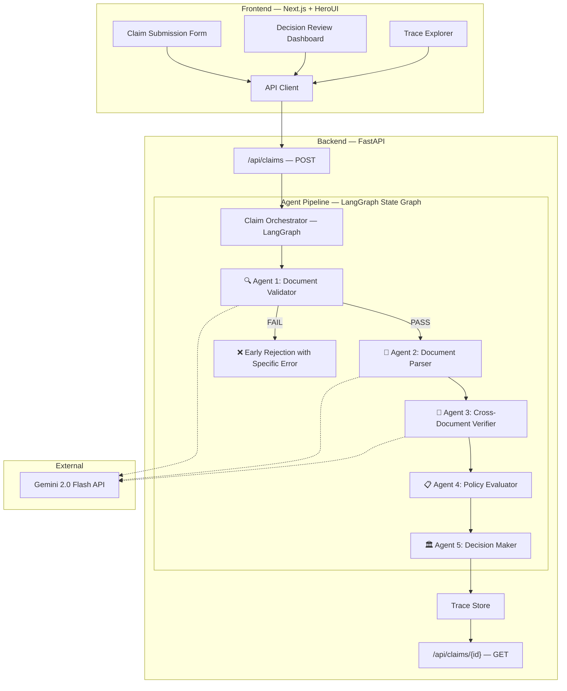

# Health Insurance Claims Processing System — Implementation Plan

## Overview

Build an **AI-powered multi-agent claims processing system** for Plum's health insurance workflow. The system accepts claim submissions with medical documents, validates documents early, extracts structured data via LLMs, applies policy rules deterministically, and produces explainable decisions with full traceability.

> [!IMPORTANT]
> **Why this architecture will impress Plum:** It mirrors their actual tech stack (Python + Next.js), uses multi-agent architecture (bonus points), has full observability traces, deterministic policy rules (not LLM-generated), and graceful degradation — all priorities from their evaluation criteria.

---

## Tech Stack

| Layer | Technology | Rationale |
|-------|-----------|-----------|
| **Backend API** | FastAPI (Python 3.12+) | Async, typed, Plum uses Python for AI |
| **AI Orchestration** | LangGraph | Multi-agent state graph with cycles, retries, human-in-loop |
| **LLM** | Google Gemini 2.0 Flash (via `google-genai`) | Vision-capable (document parsing), fast, cheap, structured output |
| **Data Validation** | Pydantic v2 | Strict contracts, JSON schema generation |
| **Frontend** | Next.js 15 (App Router) | Plum uses Next.js; SSR, routing |
| **UI Components** | HeroUI v3 + Tailwind CSS v4 | Per user request; beautiful, accessible |
| **Database** | SQLite (via SQLAlchemy) | Zero-config for assignment; easy to swap for Postgres |
| **Observability** | Custom trace system (JSON traces) | Full decision reconstruction per assignment requirement |
| **Testing** | pytest (backend), Vitest (frontend) | Assignment requires tests on every significant component |

---

## Architecture — Multi-Agent Pipeline



### Agent Responsibilities

| Agent | Input | Output | Uses LLM? | Key Design |
|-------|-------|--------|-----------|------------|
| **1. Document Validator** | Documents + claim category | Validation result with specific errors | Yes (vision) | Classifies doc type, checks quality, stops early with actionable messages |
| **2. Document Parser** | Validated documents | Structured extracted data (patient, diagnosis, amounts, etc.) | Yes (vision) | Handles handwritten docs, rubber stamps, partial text; returns confidence per field |
| **3. Cross-Document Verifier** | Extracted data from all docs | Consistency report (name mismatches, date conflicts) | No (deterministic) | Catches TC003-type issues; fuzzy name matching |
| **4. Policy Evaluator** | Extracted data + policy_terms.json | Policy check results (eligibility, limits, exclusions, waiting periods) | No (deterministic) | Pure business logic; no LLM; reads all rules from JSON |
| **5. Decision Maker** | All upstream outputs | Final decision (APPROVED/PARTIAL/REJECTED/MANUAL_REVIEW) + trace | No (deterministic) | Aggregates signals, calculates amounts, generates explanation |

> [!TIP]
> **Key design insight:** LLMs are used **only** for document understanding (Agents 1 & 2). All policy logic and decision-making is deterministic. This makes the system reliable, testable, and explainable — exactly what Plum wants.

---

## User Review Required

> [!IMPORTANT]
> **LLM Provider Choice:** I'm planning to use **Google Gemini 2.0 Flash** for document parsing (it has vision capability for image/PDF analysis). Alternatives: OpenAI GPT-4o, Anthropic Claude. Which do you prefer? This affects API key setup and costs.

> [!IMPORTANT]  
> **Deployment Strategy:** The assignment says "provide a deployed URL or clear local setup instructions." I'll provide excellent local setup (Docker Compose + one-command start). Do you also want me to set up deployment to Vercel (frontend) + Railway/Render (backend)?

> [!WARNING]
> **Mock Documents:** The test cases provide structured JSON content for documents, not actual images/PDFs. For the 12 test cases, I'll process the JSON content directly. For the demo, I'll also generate mock document images (using Python PIL/Pillow) to show the full vision pipeline working with real images.

---

## Open Questions

> [!IMPORTANT]
> **API Keys:** Which LLM API key(s) do you have available? This determines which model we use for document parsing.

> [!IMPORTANT]
> **Time Budget:** The assignment says 2-3 days. How much time do you want to invest? I can scope accordingly:
> - **Full scope (2-3 days):** All 12 test cases passing, polished UI, Docker, eval report, architecture doc
> - **Focused (1-2 days):** Core pipeline + UI + 12 test cases, less polish on docs

---

## Proposed Changes

### Project Structure

```
plum-claims/
├── backend/
│   ├── app/
│   │   ├── main.py                    # FastAPI app entry
│   │   ├── config.py                  # Settings, env vars
│   │   ├── models/
│   │   │   ├── claim.py               # Pydantic models: ClaimInput, ClaimDecision
│   │   │   ├── document.py            # DocumentInput, ExtractedDocument, ValidationResult
│   │   │   ├── policy.py              # PolicyTerms, Coverage, Member
│   │   │   └── trace.py               # TraceEntry, AgentTrace, FullTrace
│   │   ├── agents/
│   │   │   ├── orchestrator.py        # LangGraph state graph definition
│   │   │   ├── document_validator.py  # Agent 1: doc type + quality check
│   │   │   ├── document_parser.py     # Agent 2: structured extraction via LLM
│   │   │   ├── cross_verifier.py      # Agent 3: cross-doc consistency
│   │   │   ├── policy_evaluator.py    # Agent 4: deterministic policy rules
│   │   │   └── decision_maker.py      # Agent 5: final decision + amounts
│   │   ├── services/
│   │   │   ├── policy_service.py      # Load & query policy_terms.json
│   │   │   ├── llm_service.py         # Gemini API wrapper with retries
│   │   │   └── trace_service.py       # Trace storage & retrieval
│   │   ├── api/
│   │   │   ├── claims.py              # POST /claims, GET /claims/{id}
│   │   │   └── health.py              # GET /health
│   │   └── db/
│   │       ├── database.py            # SQLAlchemy setup
│   │       └── models.py              # DB models (ClaimRecord, TraceRecord)
│   ├── tests/
│   │   ├── test_document_validator.py
│   │   ├── test_document_parser.py
│   │   ├── test_cross_verifier.py
│   │   ├── test_policy_evaluator.py
│   │   ├── test_decision_maker.py
│   │   ├── test_orchestrator.py
│   │   └── test_eval_cases.py         # All 12 test cases
│   ├── data/
│   │   ├── policy_terms.json          # Copied from assignment
│   │   └── test_cases.json            # Copied from assignment
│   ├── scripts/
│   │   └── generate_mock_docs.py      # Generate test document images
│   ├── pyproject.toml
│   ├── Dockerfile
│   └── .env.example
├── frontend/
│   ├── src/
│   │   ├── app/
│   │   │   ├── layout.tsx             # Root layout with HeroUI provider
│   │   │   ├── page.tsx               # Landing / dashboard
│   │   │   ├── claims/
│   │   │   │   ├── new/page.tsx       # Claim submission form
│   │   │   │   └── [id]/page.tsx      # Claim decision review + trace
│   │   │   └── eval/page.tsx          # Eval report dashboard (12 test cases)
│   │   ├── components/
│   │   │   ├── ClaimForm.tsx          # Multi-step claim submission
│   │   │   ├── DocumentUpload.tsx     # Drag-drop document upload
│   │   │   ├── DecisionCard.tsx       # Decision display with status badge
│   │   │   ├── TraceTimeline.tsx      # Visual trace of agent pipeline
│   │   │   ├── PolicyCheckList.tsx    # Expandable policy checks
│   │   │   ├── AmountBreakdown.tsx    # Financial calculation breakdown
│   │   │   ├── ClaimsList.tsx         # List of all claims
│   │   │   ├── EvalReport.tsx         # Test case results grid
│   │   │   └── Navbar.tsx             # App navigation
│   │   ├── lib/
│   │   │   ├── api.ts                 # API client (fetch wrapper)
│   │   │   └── types.ts              # TypeScript types matching backend
│   │   └── styles/
│   │       └── globals.css            # Tailwind + HeroUI imports
│   ├── next.config.ts
│   ├── tailwind.config.ts
│   ├── tsconfig.json
│   └── package.json
├── docs/
│   ├── ARCHITECTURE.md                # System architecture document (deliverable)
│   ├── COMPONENT_CONTRACTS.md         # Component interfaces (deliverable)
│   └── EVAL_REPORT.md                 # Test results (deliverable)
├── docker-compose.yml
└── README.md
```

---

### Component 1: Data Models (Pydantic)

#### [NEW] [claim.py](file:///Users/dharun/Personal/Projects/Plum%20Assignment/backend/app/models/claim.py)

Core claim models — these are the contracts for the entire system.

```python
class ClaimInput(BaseModel):
    member_id: str
    policy_id: str
    claim_category: Literal["CONSULTATION", "DIAGNOSTIC", "PHARMACY", "DENTAL", "VISION", "ALTERNATIVE_MEDICINE"]
    treatment_date: date
    claimed_amount: float
    hospital_name: str | None = None
    ytd_claims_amount: float = 0
    claims_history: list[ClaimHistoryEntry] = []
    documents: list[DocumentInput]
    simulate_component_failure: bool = False

class ClaimDecision(BaseModel):
    claim_id: str
    decision: Literal["APPROVED", "PARTIAL", "REJECTED", "MANUAL_REVIEW"] | None
    approved_amount: float | None
    rejection_reasons: list[str] = []
    confidence_score: float
    explanation: str
    line_item_decisions: list[LineItemDecision] = []
    amount_breakdown: AmountBreakdown | None
    trace: FullTrace
    warnings: list[str] = []
    created_at: datetime
```

#### [NEW] [document.py](file:///Users/dharun/Personal/Projects/Plum%20Assignment/backend/app/models/document.py)

```python
class DocumentInput(BaseModel):
    file_id: str
    file_name: str | None = None
    actual_type: str  # Ground truth for test cases
    quality: str | None = None
    content: dict | None = None  # Structured content for test cases
    patient_name_on_doc: str | None = None

class DocumentValidationResult(BaseModel):
    file_id: str
    detected_type: str
    expected_types: list[str]
    is_valid: bool
    quality_score: float  # 0.0 - 1.0
    issues: list[DocumentIssue]

class ExtractedDocument(BaseModel):
    file_id: str
    document_type: str
    patient_name: str | None
    doctor_name: str | None
    doctor_registration: str | None
    hospital_name: str | None
    diagnosis: str | None
    treatment: str | None
    date: date | None
    medicines: list[str] = []
    line_items: list[LineItem] = []
    total_amount: float | None
    confidence: float  # Overall extraction confidence
    field_confidences: dict[str, float] = {}
```

#### [NEW] [trace.py](file:///Users/dharun/Personal/Projects/Plum%20Assignment/backend/app/models/trace.py)

```python
class TraceEntry(BaseModel):
    agent_name: str
    started_at: datetime
    completed_at: datetime
    status: Literal["SUCCESS", "FAILED", "DEGRADED", "SKIPPED"]
    input_summary: dict
    output_summary: dict
    checks_performed: list[CheckResult] = []
    confidence_impact: float = 0.0  # How much this agent changed confidence
    error: str | None = None

class FullTrace(BaseModel):
    claim_id: str
    pipeline_started_at: datetime
    pipeline_completed_at: datetime
    agent_traces: list[TraceEntry]
    overall_status: str
    confidence_breakdown: dict[str, float]
```

---

### Component 2: Agent Pipeline (LangGraph)

#### [NEW] [orchestrator.py](file:///Users/dharun/Personal/Projects/Plum%20Assignment/backend/app/agents/orchestrator.py)

LangGraph state graph that orchestrates the 5-agent pipeline:

```python
# State definition
class ClaimPipelineState(TypedDict):
    claim_input: ClaimInput
    validation_result: DocumentValidationResult | None
    extracted_documents: list[ExtractedDocument]
    cross_verification: CrossVerificationResult | None
    policy_evaluation: PolicyEvaluationResult | None
    decision: ClaimDecision | None
    trace_entries: list[TraceEntry]
    current_confidence: float
    should_stop: bool
    error_message: str | None

# Graph definition
graph = StateGraph(ClaimPipelineState)
graph.add_node("validate_documents", document_validator_node)
graph.add_node("parse_documents", document_parser_node)
graph.add_node("cross_verify", cross_verifier_node)
graph.add_node("evaluate_policy", policy_evaluator_node)
graph.add_node("make_decision", decision_maker_node)

graph.add_edge(START, "validate_documents")
graph.add_conditional_edges("validate_documents", should_continue_after_validation)
graph.add_edge("parse_documents", "cross_verify")
graph.add_conditional_edges("cross_verify", should_continue_after_verification)
graph.add_edge("evaluate_policy", "make_decision")
graph.add_edge("make_decision", END)
```

**Graceful degradation (TC011):** Each node is wrapped in a try/except. If `simulate_component_failure` is set, one agent intentionally fails. The orchestrator catches the error, logs it to the trace, reduces confidence by 0.2, and continues with whatever data is available.

#### [NEW] [document_validator.py](file:///Users/dharun/Personal/Projects/Plum%20Assignment/backend/app/agents/document_validator.py)

**Purpose:** Early document problem detection (TC001, TC002).

- Checks uploaded document types against `document_requirements` from policy_terms.json
- For test cases with `actual_type`: validates type directly
- For real images: uses Gemini vision to classify document type
- Checks quality (UNREADABLE → specific re-upload request)
- Returns actionable, specific error messages (not generic)

```
Input:  documents[] + claim_category
Output: DocumentValidationResult with specific error messages
Errors: WRONG_DOCUMENT_TYPE, MISSING_REQUIRED_DOCUMENT, UNREADABLE_DOCUMENT
```

#### [NEW] [document_parser.py](file:///Users/dharun/Personal/Projects/Plum%20Assignment/backend/app/agents/document_parser.py)

**Purpose:** Extract structured data from documents.

- For test cases with `content` dict: parse directly (already structured)
- For real images: send to Gemini with structured output schema
- Returns confidence per field
- Handles medical shorthand (HTN → Hypertension, T2DM → Type 2 Diabetes)

#### [NEW] [cross_verifier.py](file:///Users/dharun/Personal/Projects/Plum%20Assignment/backend/app/agents/cross_verifier.py)

**Purpose:** Detect cross-document inconsistencies (TC003).

- Patient name matching across all documents (fuzzy matching with fuzzywuzzy)
- Date consistency checks
- Member identity verification (does patient name match member record?)
- Returns specific mismatches with names from each document

#### [NEW] [policy_evaluator.py](file:///Users/dharun/Personal/Projects/Plum%20Assignment/backend/app/agents/policy_evaluator.py)

**Purpose:** Apply all policy rules deterministically.

Checks performed (each logged to trace):
1. **Member eligibility** — member exists, policy active
2. **Initial waiting period** — 30 days from join_date
3. **Condition-specific waiting periods** — diabetes (90d), hypertension (90d), etc. (TC005)
4. **Exclusion check** — obesity, cosmetic, etc. (TC012)
5. **Category coverage** — is claim_category covered?
6. **Sub-limit check** — category sub_limit vs claimed amount
7. **Per-claim limit** — ₹5,000 per claim limit (TC008)
8. **Annual limit** — ytd + claimed ≤ sum_insured
9. **Pre-authorization** — MRI/CT > ₹10K needs pre-auth (TC007)
10. **Fraud signals** — same-day claims count, monthly count, high-value threshold (TC009)
11. **Line item analysis** — covered vs excluded procedures (TC006 dental)
12. **Network hospital** — discount eligibility (TC010)

```
Input:  ExtractedDocument[] + PolicyTerms + ClaimInput
Output: PolicyEvaluationResult with list of CheckResult (pass/fail/warning per check)
```

#### [NEW] [decision_maker.py](file:///Users/dharun/Personal/Projects/Plum%20Assignment/backend/app/agents/decision_maker.py)

**Purpose:** Aggregate all signals into final decision.

- **APPROVED:** All checks pass → calculate approved amount
- **PARTIAL:** Some line items excluded (TC006) → approve only covered items
- **REJECTED:** Hard failure (waiting period, exclusion, per-claim limit, pre-auth missing)
- **MANUAL_REVIEW:** Fraud signals triggered (TC009), or high-value claims

Amount calculation order (critical for TC010):
1. Start with claimed amount
2. Apply network discount (if applicable) — **before** co-pay
3. Apply co-pay percentage
4. Cap at sub-limit
5. Cap at per-claim limit
6. Cap at remaining annual limit

---

### Component 3: Backend API

#### [NEW] [claims.py](file:///Users/dharun/Personal/Projects/Plum%20Assignment/backend/app/api/claims.py)

```python
# POST /api/claims — Submit a new claim
# Request: ClaimInput (JSON body)
# Response: ClaimDecision (with full trace)

# GET /api/claims — List all claims
# Response: list[ClaimSummary]

# GET /api/claims/{claim_id} — Get claim details with trace
# Response: ClaimDecision

# POST /api/claims/eval — Run all 12 test cases
# Response: EvalReport with pass/fail per case
```

#### [NEW] [llm_service.py](file:///Users/dharun/Personal/Projects/Plum%20Assignment/backend/app/services/llm_service.py)

Gemini API wrapper with:
- Retry logic (exponential backoff, 3 retries)
- Timeout handling (30s timeout)
- Structured output enforcement (Pydantic schema → Gemini response_schema)
- Graceful failure (returns partial result + low confidence on error)

---

### Component 4: Frontend — Next.js + HeroUI

#### Pages

| Route | Page | Components |
|-------|------|------------|
| `/` | Dashboard | ClaimsList, stats summary |
| `/claims/new` | Submit Claim | ClaimForm (multi-step), DocumentUpload |
| `/claims/[id]` | Decision Review | DecisionCard, TraceTimeline, PolicyCheckList, AmountBreakdown |
| `/eval` | Eval Report | EvalReport (12 test cases grid with results) |

#### [NEW] [ClaimForm.tsx](file:///Users/dharun/Personal/Projects/Plum%20Assignment/frontend/src/components/ClaimForm.tsx)

Multi-step form with HeroUI components:
1. **Step 1:** Member selection (Select), claim category (RadioGroup), treatment date (DatePicker)
2. **Step 2:** Document upload (drag-drop zone), amount input
3. **Step 3:** Review & submit

Uses HeroUI: `Card`, `Select`, `RadioGroup`, `DatePicker`, `Input`, `Button`, `Progress`

#### [NEW] [TraceTimeline.tsx](file:///Users/dharun/Personal/Projects/Plum%20Assignment/frontend/src/components/TraceTimeline.tsx)

**This is the "wow" component** — visual pipeline trace showing:
- Each agent as a node in a vertical timeline
- Status badges (✅ Pass, ❌ Fail, ⚠️ Degraded)
- Expandable details per agent showing what was checked
- Confidence score progression (animated bar)
- Duration per agent
- Specific error messages inline

#### [NEW] [DecisionCard.tsx](file:///Users/dharun/Personal/Projects/Plum%20Assignment/frontend/src/components/DecisionCard.tsx)

Large card with:
- Decision badge (APPROVED = green, PARTIAL = amber, REJECTED = red, MANUAL_REVIEW = blue)
- Approved amount with breakdown tooltip
- Confidence score as circular progress
- Key reason summary

#### UI Design Direction

- **Dark mode default** (Plum's brand feel)
- **Color palette:** Deep navy (#0a0e27) background, electric blue (#3b82f6) accents, emerald (#10b981) for approvals, amber (#f59e0b) for partials, rose (#f43f5e) for rejections
- **Glassmorphism** cards with subtle backdrop blur
- **Animated transitions** between pipeline steps
- **HeroUI Chip/Badge** for status labels, **Accordion** for trace details, **Table** for eval report

---

### Component 5: Deliverable Documents

#### [NEW] [ARCHITECTURE.md](file:///Users/dharun/Personal/Projects/Plum%20Assignment/docs/ARCHITECTURE.md)

Covers:
- System overview with architecture diagram
- Why multi-agent (modularity, testability, observability)
- Why LLMs only for document understanding, not policy logic
- Trade-offs made and alternatives considered
- Scaling to 10x: swap SQLite → Postgres, add Redis for caching, queue-based processing, horizontal scaling of agents
- Limitations and future improvements

#### [NEW] [COMPONENT_CONTRACTS.md](file:///Users/dharun/Personal/Projects/Plum%20Assignment/docs/COMPONENT_CONTRACTS.md)

For each agent and service: input schema, output schema, error types, with examples.

#### [NEW] [EVAL_REPORT.md](file:///Users/dharun/Personal/Projects/Plum%20Assignment/docs/EVAL_REPORT.md)

Auto-generated from running all 12 test cases. Shows:
- Decision produced vs expected
- Full trace per case
- Pass/fail assessment
- Explanation for any mismatches

---

## Test Coverage Per Test Case

| TC | Name | Primary Agent Tested | Key Assertion |
|----|------|---------------------|---------------|
| TC001 | Wrong Document | Document Validator | Stops early, names uploaded vs required type |
| TC002 | Unreadable Document | Document Validator | Identifies unreadable, asks re-upload |
| TC003 | Different Patients | Cross-Document Verifier | Detects name mismatch, shows both names |
| TC004 | Clean Approval | Full Pipeline | APPROVED, ₹1,350 (10% co-pay), confidence > 0.85 |
| TC005 | Waiting Period | Policy Evaluator | REJECTED, states eligible date |
| TC006 | Dental Partial | Policy Evaluator + Decision Maker | PARTIAL, ₹8,000, itemized approval/rejection |
| TC007 | MRI Pre-Auth | Policy Evaluator | REJECTED, explains pre-auth requirement |
| TC008 | Per-Claim Limit | Policy Evaluator | REJECTED, states limit vs claimed amount |
| TC009 | Fraud Signal | Policy Evaluator | MANUAL_REVIEW, lists fraud signals |
| TC010 | Network Discount | Decision Maker | APPROVED, ₹3,240, correct discount→co-pay order |
| TC011 | Component Failure | Orchestrator | APPROVED, degraded confidence, manual review note |
| TC012 | Excluded Treatment | Policy Evaluator | REJECTED, cites exclusion, confidence > 0.90 |

---

## Verification Plan

### Automated Tests

```bash
# Backend unit tests — one test file per agent
cd backend && pytest tests/ -v

# Run all 12 eval test cases
cd backend && pytest tests/test_eval_cases.py -v

# Frontend type checking
cd frontend && npx tsc --noEmit
```

### Manual Verification

1. Start system locally → submit a claim via UI → verify decision + trace displays correctly
2. Run `/api/claims/eval` endpoint → verify all 12 test cases match expected outcomes
3. Check that early-stop cases (TC001-TC003) show specific, actionable error messages
4. Verify TC010 amount calculation: network discount before co-pay
5. Verify TC011 shows degraded confidence and component failure in trace

### Browser Testing

- Use Chrome DevTools MCP to screenshot key UI flows
- Verify dark mode rendering
- Test claim submission flow end-to-end

---

## Execution Order

1. **Backend models** (Pydantic) — foundation for everything
2. **Policy service** — load and query policy_terms.json
3. **Agent 4: Policy Evaluator** — most deterministic, easiest to test
4. **Agent 5: Decision Maker** — amount calculations
5. **Agent 1: Document Validator** — early stop logic
6. **Agent 3: Cross-Document Verifier** — consistency checks
7. **Agent 2: Document Parser** — LLM integration (test last since it needs API key)
8. **Orchestrator** — wire agents together with LangGraph
9. **API routes** — expose pipeline via FastAPI
10. **Run all 12 test cases** — verify correctness
11. **Frontend** — Next.js + HeroUI pages
12. **Deliverable documents** — architecture, contracts, eval report
13. **Polish** — error handling, edge cases, UI animations
